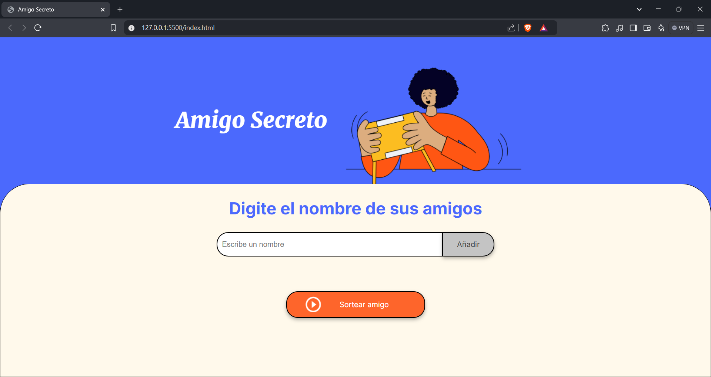
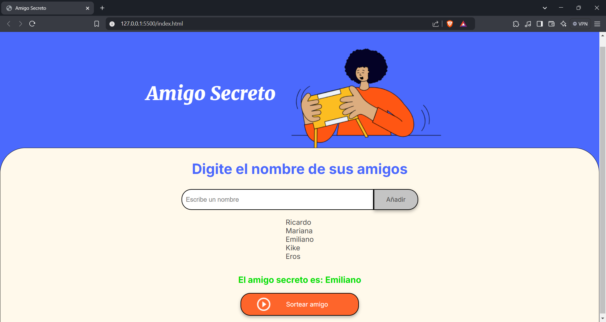

# Amigo Secreto 🎁

## Descripción 📖

_Amigo Secreto_ es una aplicación web interactiva que permite a los usuarios agregar nombres de amigos y realizar un sorteo aleatorio para determinar quién será el amigo secreto.

Es perfecta para organizar intercambios de regalos de manera sencilla y divertida.

SI deseas probarla está activa en pages: https://wreckinge.github.io/challenge-amigo-secreto/

---

## Características 

- **Añadir amigos**: Ingresa nombres de participantes a través de un campo de texto.
- **Sorteo aleatorio**: Selecciona un amigo secreto de manera justa y al azar.
- **Interfaz amigable**: Diseño limpio y responsivo.
- **Resultados inmediatos**: Visualiza el nombre sorteado en tiempo real.

---

## Capturas de pantalla 📸

Aquí hay una vista previa de la aplicación en acción:

### Pantalla principal


### Sorteo en acción


---

## Requisitos previos ⚙️

- Navegador web actualizado (Chrome, Firefox, Edge, etc.).
- Archivo `index.html` y conexión a los archivos `style.css` y `app.js`.

---

## Instalación 🚀

1. Clona este repositorio:
   ```bash
   git clone https://github.com/tuusuario/amigo-secreto.git
   ```
2. Navega a la carpeta del proyecto:
   ```bash
   cd amigo-secreto
   ```
3. Abre el archivo `index.html` en tu navegador.

---

## Contribuciones 🤝

¡Las contribuciones son bienvenidas! Si deseas colaborar, por favor:

1. Haz un fork del proyecto.
2. Crea una rama con tu nueva funcionalidad:
   ```bash
   git checkout -b feature/nueva-funcionalidad
   ```
3. Realiza tus cambios y haz commit:
   ```bash
   git commit -m "Añadida nueva funcionalidad"
   ```
4. Envía un pull request.

